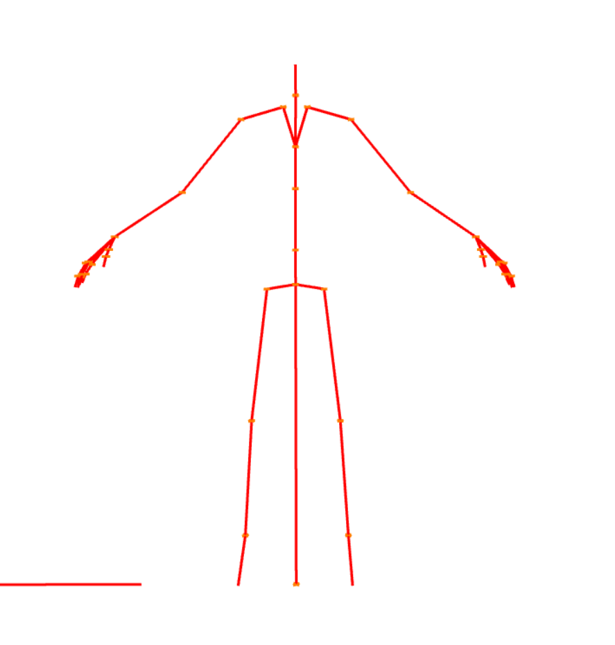
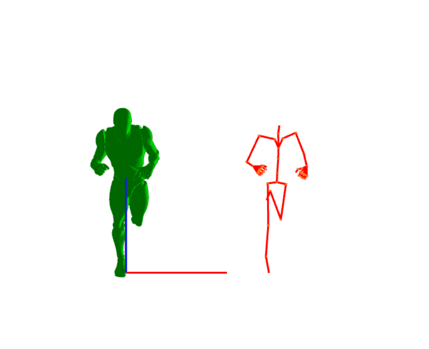
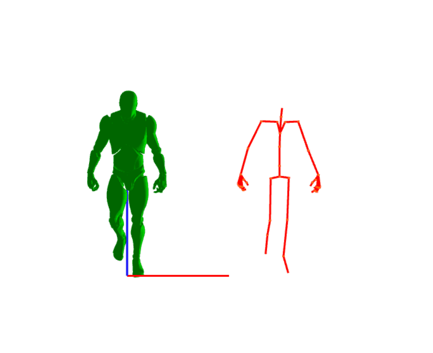
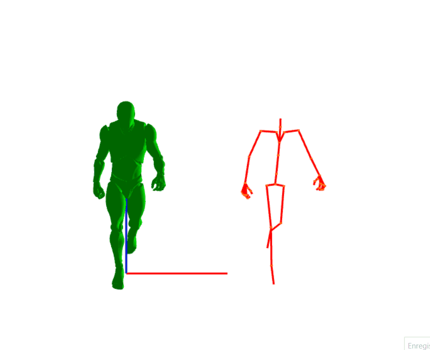

# Animation Programming

## <h2 id="top">Summary</h2>
---
-[Introduction](#intro)   
-[Currently implemented](#implements)   
-[Work in progress](#wip)   
-[Difficulty through the project](#difficulty)  
-[Gallery](#gallery)

## <h2 id="intro">Introduction</h2>

The animation programming project consisted of coding a skeleton in order to make it move and his mesh too with an animation.   

> In the engine we used, there is data races so the mesh can disappear.  
The default display is Blended Animation (walk to run). If you want just one animation, you can comment the `#define BLEND` in [AnimationProgramming.cpp](AnimationProgramming.cpp).

## <h2 id="implements">Currently Implemented</h2>
- We drewn the skeleton on T-Pose.
- We drewn the skeleton when it is running or walking.
- We added to the T-Pose and anim-Pos all the joint of the skeleton.
- We added a slerp between all the frame of the animation to create something smooth and fluid.
- We also created a transition between the running and the walking animation, so you can see them both (crossfade AKA blending).

## <h2 id="wip">Work in progress</h2>
- We started to think about the weight.

## <h2 id="difficulty">Difficulty through the project</h2>
- The main difficulty was to have a clean and logical architecture in relation to what we wanted to do. In the beginning of the project we had drawn the T-Pose skeleton and after that, for drawing the animation, we concluded that we had to redo the architecture from the start, because it was not possible to do what we wanted with the current architecture.

## <h2 id="gallery">Gallery</h2>
   
   
   
   

[Top of the page](#top)